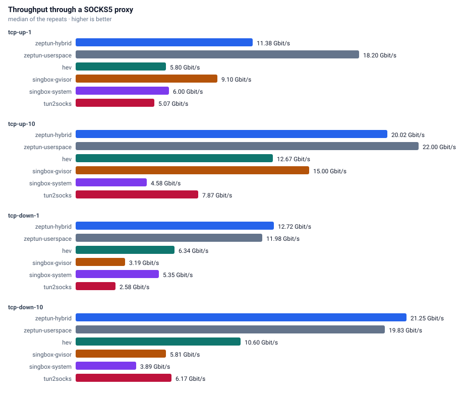
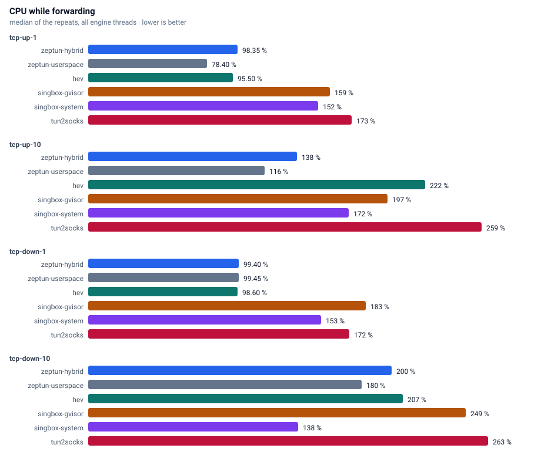
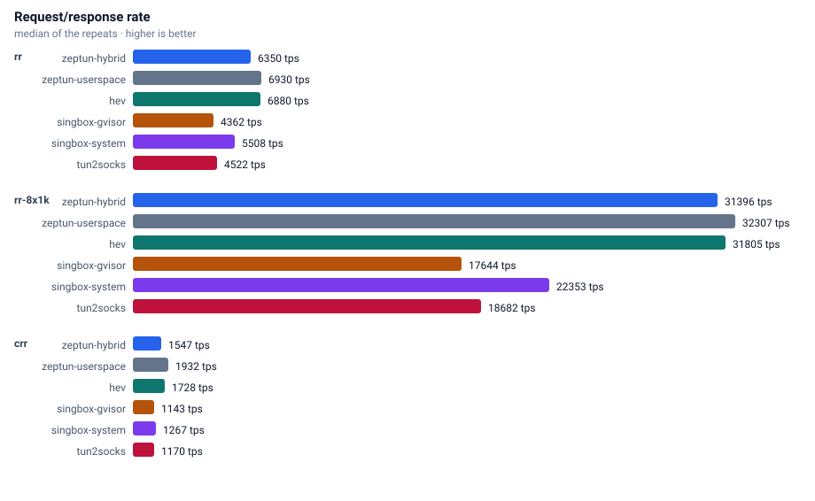
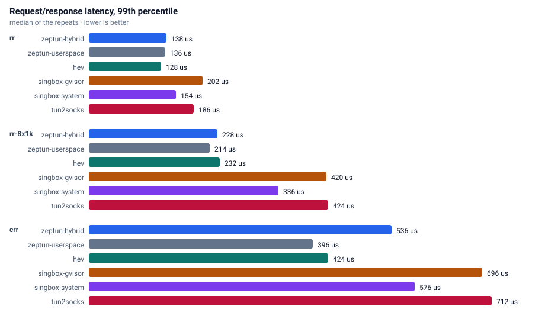
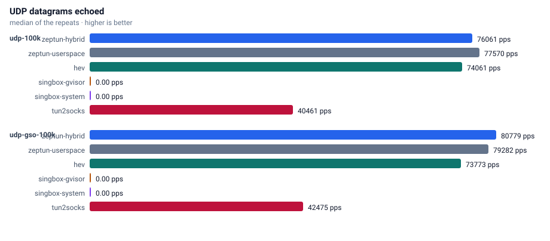
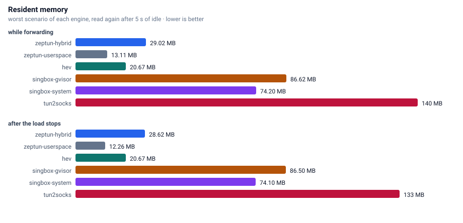

# Benchmarks

Every number on this page comes from the `benchmark` workflow in this repository, run on a GitHub-hosted runner.

## Machine

| property | value |
|---|---|
| runner image | ubuntu24 20260907.300.1 |
| cpu | AMD EPYC 7763 64-Core Processor |
| cpu cores | 4 |
| memory | 15.6 GB |
| kernel | Linux 6.17.0-1022-azure |
| zig | 0.16.0 |
| date | 2026-09-17 |

## Method

Two network namespaces joined by a veth pair. Traffic enters the tunnel device (MTU 8500), leaves through the same SOCKS5 server (hev-socks5-server) for every engine, and reaches the servers in the second namespace. Engines are interleaved: each round starts every engine once and runs every scenario against it, so background noise spreads evenly. CPU comes from `/proc/<pid>/stat` and memory from `VmRSS`, summed over all processes of an engine.

Duration 8 s per scenario, 2 rounds, 4 queues.

## Throughput

## CPU

## Request/response

## UDP

## Memory

## Raw results

| engine | scenario | median | cpu % | max rss MB |
|---|---|---:|---:|---:|
| zeptun-userspace | tcp-up-1 | 18.995 Gbit/s | 81 | 13.1 |
| zeptun-userspace | tcp-up-10 | 23.007 Gbit/s | 121 | 21.1 |
| zeptun-userspace | tcp-down-1 | 12.224 Gbit/s | 99 | 21.1 |
| zeptun-userspace | tcp-down-10 | 20.488 Gbit/s | 179 | 35.3 |
| zeptun-userspace | rr | 7038 tps p50=134us p99=174us p99.9=200us  | 36 | 37.3 |
| zeptun-userspace | rr-8x1k | 33056 tps p50=230us p99=472us p99.9=600us  | 94 | 37.3 |
| zeptun-userspace | crr | 1947 tps p50=496us p99=568us p99.9=648us  | 44 | 37.3 |
| zeptun-userspace | udp-100k | 81010 echo pps (81.0% of 100000 sent)  | 72 | 43.4 |
| zeptun-userspace | udp-gso-100k | 82808 echo pps (82.8% of 99992 sent)  | 55 | 43.4 |
| hev | tcp-up-1 | 6.115 Gbit/s | 95 | 14.7 |
| hev | tcp-up-10 | 13.897 Gbit/s | 225 | 16.2 |
| hev | tcp-down-1 | 6.441 Gbit/s | 99 | 15.3 |
| hev | tcp-down-10 | 11.122 Gbit/s | 213 | 16.0 |
| hev | rr | 7024 tps p50=136us p99=176us p99.9=194us  | 39 | 15.3 |
| hev | rr-8x1k | 32472 tps p50=234us p99=476us p99.9=616us  | 124 | 15.8 |
| hev | crr | 1729 tps p50=560us p99=640us p99.9=720us  | 64 | 15.5 |
| hev | udp-100k | 76250 echo pps (76.3% of 99996 sent)  | 98 | 18.0 |
| hev | udp-gso-100k | 75919 echo pps (75.9% of 99992 sent)  | 98 | 20.7 |
| zeptun-hybrid | tcp-up-1 | 15.672 Gbit/s | 99 | 15.4 |
| zeptun-hybrid | tcp-up-10 | 22.432 Gbit/s | 162 | 27.6 |
| zeptun-hybrid | tcp-down-1 | 13.494 Gbit/s | 99 | 27.6 |
| zeptun-hybrid | tcp-down-10 | 22.353 Gbit/s | 198 | 27.7 |
| zeptun-hybrid | rr | 6351 tps p50=152us p99=194us p99.9=242us  | 40 | 27.7 |
| zeptun-hybrid | rr-8x1k | 31747 tps p50=242us p99=472us p99.9=616us  | 150 | 27.7 |
| zeptun-hybrid | crr | 1548 tps p50=632us p99=752us p99.9=920us  | 67 | 32.2 |
| zeptun-hybrid | udp-100k | 82088 echo pps (82.1% of 99988 sent)  | 74 | 34.2 |
| zeptun-hybrid | udp-gso-100k | 81259 echo pps (81.3% of 99984 sent)  | 55 | 36.2 |
| singbox-system | tcp-up-1 | 6.107 Gbit/s | 154 | 61.5 |
| singbox-system | tcp-up-10 | 4.537 Gbit/s | 167 | 61.8 |
| singbox-system | tcp-down-1 | 5.155 Gbit/s | 151 | 61.7 |
| singbox-system | tcp-down-10 | 3.831 Gbit/s | 138 | 61.6 |
| singbox-system | rr | 5515 tps p50=176us p99=210us p99.9=238us  | 60 | 61.7 |
| singbox-system | rr-8x1k | 22489 tps p50=336us p99=680us p99.9=944us  | 156 | 61.7 |
| singbox-system | crr | 1274 tps p50=768us p99=896us p99.9=1456us  | 99 | 72.7 |
| singbox-system | udp-100k | 0 echo pps (0.0% of 100000 sent)  | 85 | 75.1 |
| singbox-system | udp-gso-100k | 0 echo pps (0.0% of 99992 sent)  | 76 | 75.2 |
| tun2socks | tcp-up-1 | 5.158 Gbit/s | 173 | 21.2 |
| tun2socks | tcp-up-10 | 7.887 Gbit/s | 259 | 38.6 |
| tun2socks | tcp-down-1 | 2.691 Gbit/s | 171 | 42.7 |
| tun2socks | tcp-down-10 | 6.287 Gbit/s | 264 | 123.9 |
| tun2socks | rr | 4528 tps p50=220us p99=252us p99.9=332us  | 72 | 127.6 |
| tun2socks | rr-8x1k | 18736 tps p50=404us p99=832us p99.9=1120us  | 167 | 144.8 |
| tun2socks | crr | 1174 tps p50=824us p99=1024us p99.9=2048us  | 91 | 144.8 |
| tun2socks | udp-100k | 39732 echo pps (39.8% of 99928 sent)  | 219 | 48.2 |
| tun2socks | udp-gso-100k | 42961 echo pps (43.0% of 99963 sent)  | 232 | 40.4 |
| singbox-gvisor | tcp-up-1 | 9.290 Gbit/s | 160 | 71.2 |
| singbox-gvisor | tcp-up-10 | 15.115 Gbit/s | 200 | 82.4 |
| singbox-gvisor | tcp-down-1 | 3.252 Gbit/s | 182 | 82.4 |
| singbox-gvisor | tcp-down-10 | 5.865 Gbit/s | 249 | 88.7 |
| singbox-gvisor | rr | 4365 tps p50=228us p99=300us p99.9=356us  | 79 | 87.5 |
| singbox-gvisor | rr-8x1k | 17798 tps p50=432us p99=824us p99.9=1216us  | 169 | 74.3 |
| singbox-gvisor | crr | 1145 tps p50=848us p99=1040us p99.9=1856us  | 103 | 76.9 |
| singbox-gvisor | udp-100k | 0 echo pps (0.0% of 99988 sent)  | 168 | 77.7 |
| singbox-gvisor | udp-gso-100k | 0  | 0 | 77.6 |

zeptun: startup 4 ms, idle 4892 KB, 3 wakeups in 20 s | tcp 1000: 9092 KB (conns: 1000/1000 established, 0 failed, 1768 conn/s) | udp 1000: 14020 KB (udp flows: 1000/1000 answered, 8199 flows/s)
hev: startup 3 ms, idle 2217 KB, 2 wakeups in 20 s | tcp 1000: 78794 KB (conns: 1000/1000 established, 0 failed, 1860 conn/s) | udp 1000: 27326 KB (udp flows: 1000/1000 answered, 7263 flows/s)
singbox-system: startup 49 ms, idle 57621 KB, 6 wakeups in 20 s | tcp 1000: 73984 KB (conns: 1000/1000 established, 0 failed, 1341 conn/s) | udp 1000: 69072 KB (udp flows: 0/1000 answered, 0 flows/s)
singbox-gvisor: startup 50 ms, idle 57765 KB, 123 wakeups in 20 s | tcp 1000: 97768 KB (conns: 1000/1000 established, 0 failed, 1246 conn/s) | udp 1000: 101280 KB (udp flows: 0/1000 answered, 0 flows/s)
tun2socks: startup 5 ms, idle 15840 KB, 258 wakeups in 20 s | tcp 1000: 109256 KB (conns: 1000/1000 established, 0 failed, 1214 conn/s) | udp 1000: 183812 KB (udp flows: 1000/1000 answered, 5920 flows/s)
